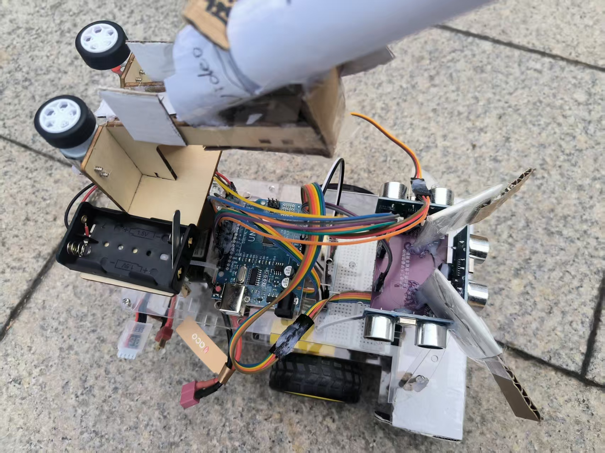
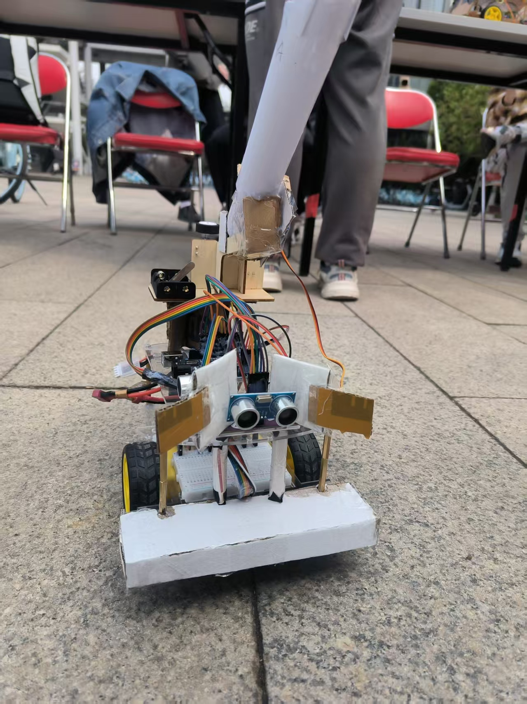
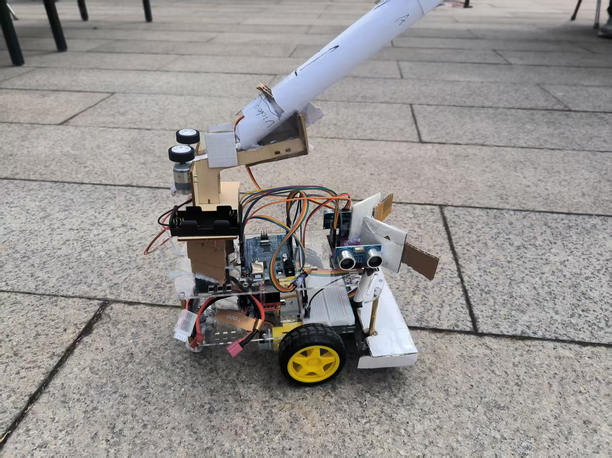
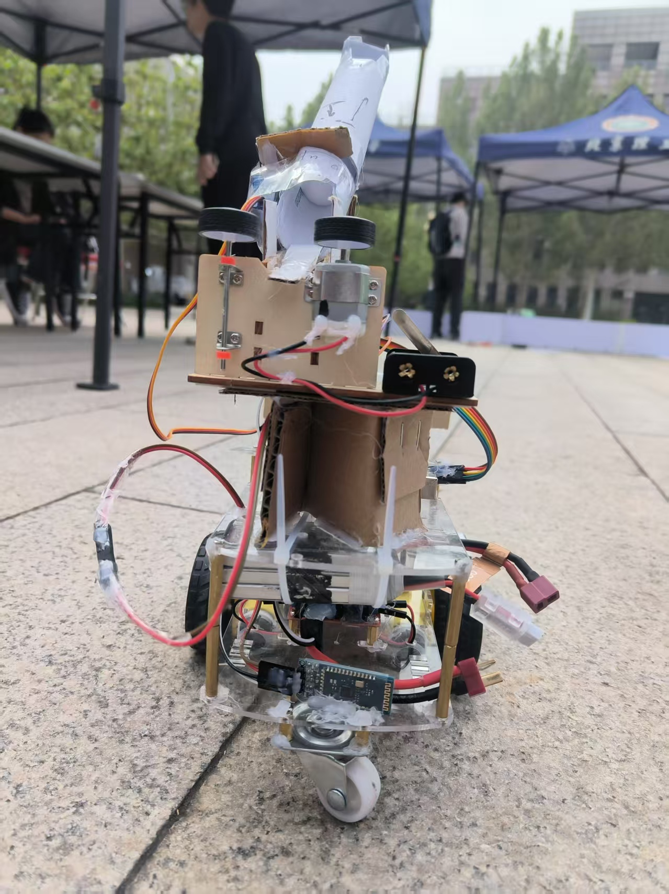
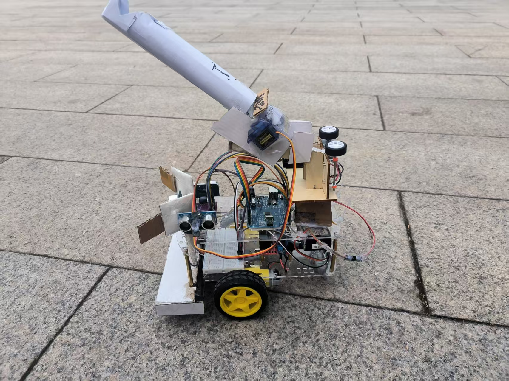

# 屠龙勇士比赛（BIT睿信）
该项目用于2025年春季学期睿信书院——屠龙比赛。

该项目包含：
- 教学文档（接线指导）
- 测试代码【端口分布图、各元器件单独测试脚本、2024年的整合代码】
- 完整代码

# 官方比赛规则提炼
1. 拒绝代码抄袭（上赛道前由赛方备份代码，并在赛方人员的监督下将与备份代码同一个版本的代码进行烧录）
2. 不允许使用额外的电子类模块；可以添加非电子模块；
3. 长度、宽度小于25cm；高度无要求；

# 关卡说明
## 关卡1：自动循迹
- 包括直线、锐角弯、钝角弯、S弯、斜坡；通过斜坡可额外加5分
- 禁止以非红外巡线的方式完成此关卡

## 关卡2：超声波避障
- 包括狭长通道、多个转弯
- 终点前设有粗黑色横线，若小车行驶至该横线处自动停下，则额外加5分

## 关卡3：屠龙勇士
- 出口1无守卫龙，出口2设有守卫龙，每撞倒一条龙得5分
- 使用泡沫球射击守卫龙。每辆小车共有6次射击机会；
- - 若不使用舵机控制，手动放置小球，每击中一条守卫龙得5分
- - 通过舵机控制泡沫球自动装填并发射命中守卫龙则得10分，多次命中同一条龙不重复得分

# 该小车运行数据
（以手动模式;11.2v为例）
|功能|变动效果|
|:-:|:-:|
慢速前进 * 3|10cm
快速前进 * 3|28cm
快左/右转 * 1|原地80+
慢左/右转 * 3|原地90
慢小左/右转 * 8 |向前90，不动轮几乎不动
快小左/右转 * 3 |向前90，不动轮几乎不转

---
# 本Repo食用指导
1. 先进入`./分模块组装`完成各项元器件的质量检测，及时更换运行状态不良好的元器件；接线时勿采用永久化措施（例如我在初步确认方案后直接上热熔胶，导致我后面调整了几次接线很狼狈））……
2. 最终接线方案可以参考`./分模块组装/布局图.drawio`或`./SmartCar/SmartCar.ino`程序内对端口的定义；原因可见CSDN博文[Arduino 舵机和PWM驱动轮冲突](https://blog.csdn.net/YouCloud_21St/article/details/146642996)
3. 教学文档可参考`./分模块组装/逐步引导搭建（物理）`，亦可前往博客[【屠龙勇士】BIT睿信书院屠龙勇士心得总结](https://blog.csdn.net/YouCloud_21St/article/details/147374439)
4. AIGC声明：使用过Deepseek v3模型（Deepseek官方网页版，腾讯元宝网页版）；感谢支持

---
# 小车三维照片~~
- 上视图

- 前视图

- 右视图

- 后视图

- 左视图
