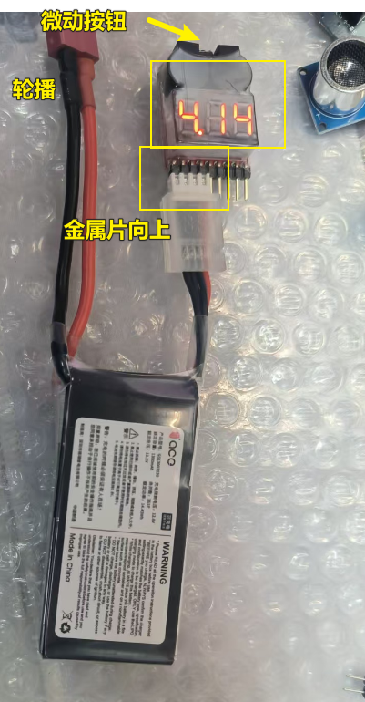
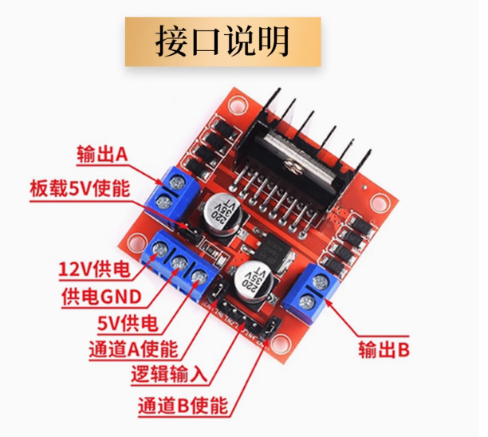
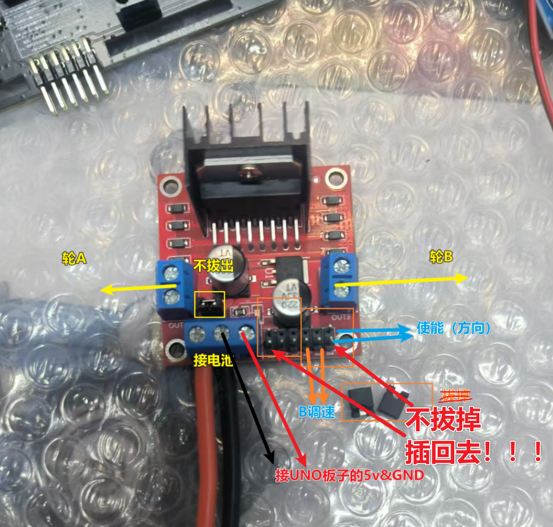
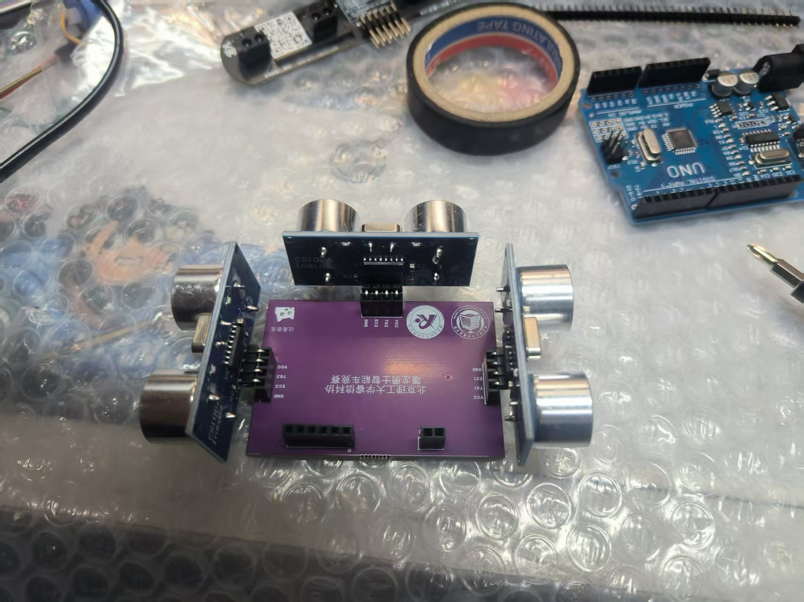
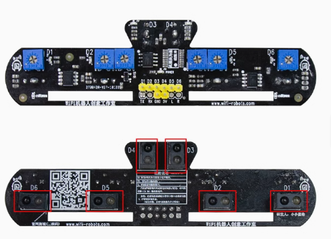
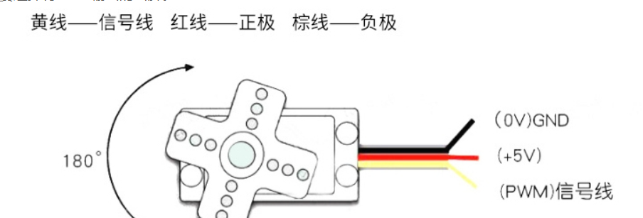
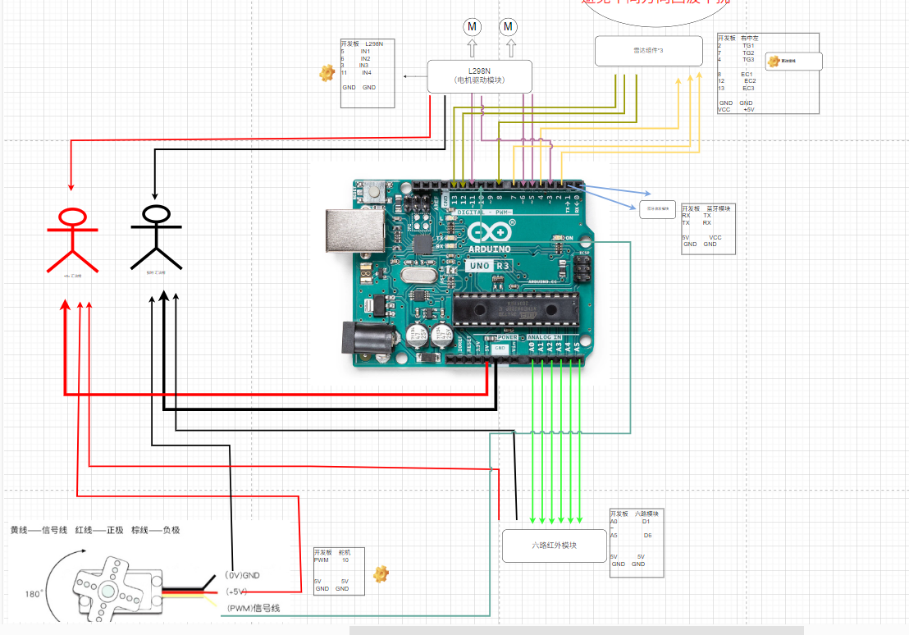

# 逐步引导搭建小车（物理）
这个部分将会引导你搭建小车；其中元件部分的内容，可以由某宝网上查找~
==注意，在最终接线方案确定前，请勿鲁莽s永久性固定你的接线（可能会因为线的长度问题加线）==

# 1. 元件说明和简单测试脚本

## 1.1 电压测试器
直接插到航模电池的充电口（即单只电池口）；有金属片的一面向上
- 插入后将会响一声（特别洪亮）
- 然后显示总电压、分电压（用的3s就显示三个的分别电压）
- 按住喇叭后面的微动按钮，可以调整报警值；若电池低于报警值，蜂鸣器和红灯将会报警

## 1.2 L298N 电机驱动模块
由于本文主要服务于比赛，就不额外讲这个模块的可选配置了，直接按照我的方案来做就好。
这个接线在接线柱放到最松的时候，可以直接怼进去（可以适度用钳子压扁）；再拧紧，防止虚接（徐姐发热）

一下是接线图，除了电池正负极外，不需要纠结电机的正负极，这个到时候直接调整代码即可。

这个时候参考`布局图.draw`接线；在测试代码里面选择电机驱动代码进行测试

## 1.3 HC-SR04 雷达模块

逐个插进去，如图。所有的T端口插在面包板上进行汇流（少了材料记得找组织方补充）

 
 这个时候参考`布局图.draw`接线；在测试代码里面选择雷达代码进行测试

## 1.4 六路红外循迹
  
这个时候参考`布局图.draw`接线；在测试代码里面选择六路红外代码进行测试

## 1.5 SG90 舵机

这个时候参考`布局图.draw`接线；在测试代码里面选择舵机代码进行测试

## 1.6 蓝牙 
 参考`布局图.draw`接线；不用单独测试。但是每次通过串口刷写数据的时候，必须断开蓝牙的上传和下载接线。因为串口线公用，接蓝牙会导致程序刷写失败。

# 2. 整体接线
这张图片就是`布局图.draw`；高清图片可以看源文件
